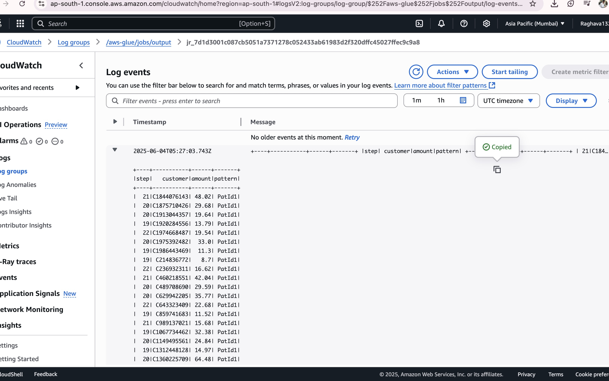

### Bank-Transaction-Pattern-Detection-System.

This project implements an end-to-end detection system for identifying notable transaction behaviors across customers and merchants using large-scale data. The system uses:

- **Mechanism X**: Splits and uploads transaction data into chunks.
- **Mechanism Y**: Detects suspicious transaction patterns using PySpark (AWS Glue) and stores alerts in S3.
  
It involves real-time-like streaming of data via S3, pattern analysis using Glue jobs, and output batching. PostgreSQL is used for intermediate metadata storage.

---

## 🧱 Block Diagram

**Description**:  
The block diagram outlines the overall architecture of the system:

- **Google Drive** → Hosts the original `transactions.csv` and `CustomerImportance.csv`.
- **Mechanism X** (in Jupyter Notebook) → Reads the CSV, splits it into 10,000-row chunks, and uploads to S3 in Parquet format.
- **Mechanism Y** (Glue PySpark Script) → Watches for new chunks in S3, applies detection logic using the importance data, and writes batched results (50 per file) back to another S3 folder.
- **PostgreSQL** → Used to optionally track job metadata/state.
- **CloudWatch Logs** → Monitors Glue script execution.

---

## ⚙️ AWS Glue Job Logs

**Description**:  
These logs provide insights into:

- When chunks are picked up by Glue
- Execution flow and time per detection step
- Any failures or data anomalies encountered
- Helpful for debugging and optimization

---

## 📂 Sample S3 Input Chunks

**Description**:  
Each file (e.g., `chunk_00001.parquet`) contains exactly 10,000 transactions read from the original CSV. These are:

- In Parquet format for optimal performance in Spark
- Continuously uploaded by Mechanism X
- Monitored by Glue job (Mechanism Y) in real time

---
## Implementation of glue pyspark

## ✅ Output Detection Files

- These outputs are written by Glue and saved back to a separate S3 path
- Ideal for real-time review or analytics dashboards

---

✅ This project showcases how distributed systems, cloud storage, and big data tools like AWS Glue and S3 can be used to automate detection pipelines in a scalable way.

